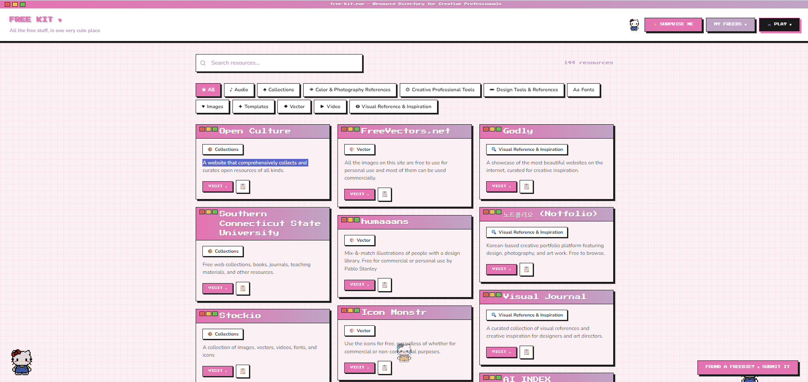
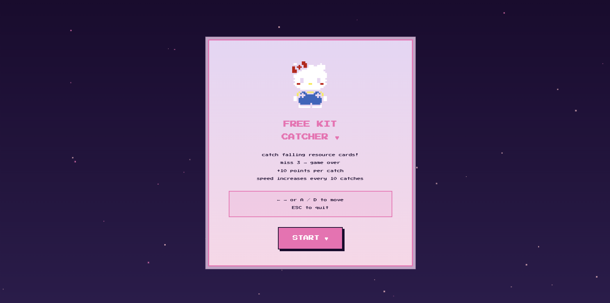

# Free Kit ♥

> **Status:** Live · Updated weekly

**All the free stuff, in one very cute place.**

70+ genuinely free design resources — stock photos, fonts, tools, templates, colour palettes, references — in one searchable directory. Community-sourced. No paywalls, no credit card walls, no surprises.

🌐 **Live:** [free-kit-project.vercel.app](https://free-kit-project.vercel.app)

---

## The idea

Every creative professional has a scattered list of free resources. Everyone's is different. Everyone's gets outdated. Everyone re-Googles "free stock photos" every few months because they forgot where they saved that one good site.

Free Kit is what should already exist.

---

## Screenshots



<br/>



---

## What's inside

| Category | What you'll find |
|---|---|
| 🖼️ **Images** | Stock photos, illustrations, icons, mockups |
| 🎬 **Video** | Stock footage, motion graphics, film references |
| 🎵 **Audio** | Music, sound effects, ambient audio |
| 🔤 **Fonts** | Open source, commercial-use, display fonts |
| 🔍 **Reference** | Film stills, moodboards, design inspiration |
| 🎨 **Color** | Palette generators, color theory tools |
| 🛠️ **Tools** | Design, editing, compression, 3D tools |
| 📄 **Templates** | Presentation, web, and design templates |

---

## Features

**Browse & filter** — real-time search, one-click category filter, no friction between need and found

**NEW THIS WEEK** — horizontal strip of latest additions, updated every Sunday

**Surprise Me ✨** — random resource when you don't know what you need

**Copy link** — one click, confetti included

**Free Kit Catcher ♥** — catch falling resource cards to save them to your list. Arrow keys or A/D. Catch 5 in a row for 2x score multiplier. Gold cards = +50 points. The game mechanic is the argument: exploration beats scrolling.

---

## Tech stack

- React + Vite
- Vanilla CSS (Press Start 2P + Nunito)
- localStorage — scores and saved resources, client-side only
- Vercel
- JSON data file — no backend, no database, no API keys

---

## Contribute

Found something that should be here? Hit **"FOUND A FREEBIE? ♥ SUBMIT IT"** on the site, or email with: resource name · URL · category · why it's useful. List updates every Sunday.

---

## Run locally

```bash
git clone https://github.com/pranjalsuthar-555/free-kit.git
cd free-kit
npm install
npm run dev
# → http://localhost:5173
```

---

## License

MIT — use it, fork it, build on it.
Don't charge people for the resources listed. They're free. That's the whole point. ♥

---

Built by **Pranjal Suthar** — solving a problem I had ten times a week.

→ [GitHub](https://github.com/pranjalsuthar-555) · [LinkedIn](https://www.linkedin.com/in/sutharpranjal) · [Email](mailto:pranjalsuthar.work@gmail.com)
